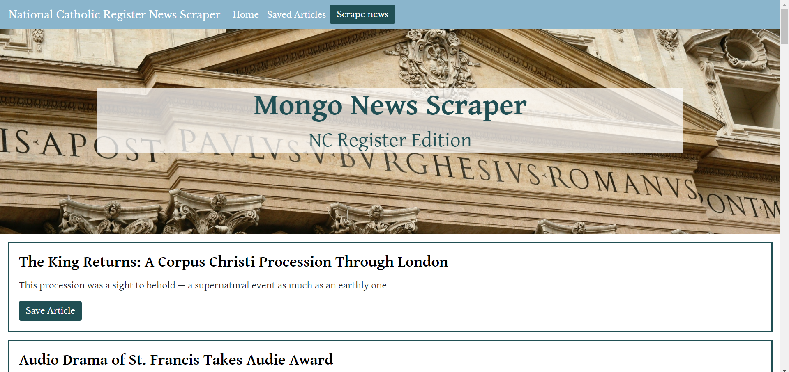

# News-Scraper

## Coding Bootcamp Project

#### Full stack web app which scrapes an online news source and allows user to save and comment on articles. Uses a Mongo database as well as cheerio, express, express handlebars, mongoose ORM, and request npm packages.

This full stack based web application uses cheerio to scrape news headlines from www.ncregister.com, an online Catholic news source, and loads it into a MongoDB database. New articles can be scraped to the database as they become available. Links to the original articles are provided, as well as the ability to save articles onto a separate "Saved Articles" page. Here users can add comments to saved articles as well as delete comments or saved articles.

Screenshot:

